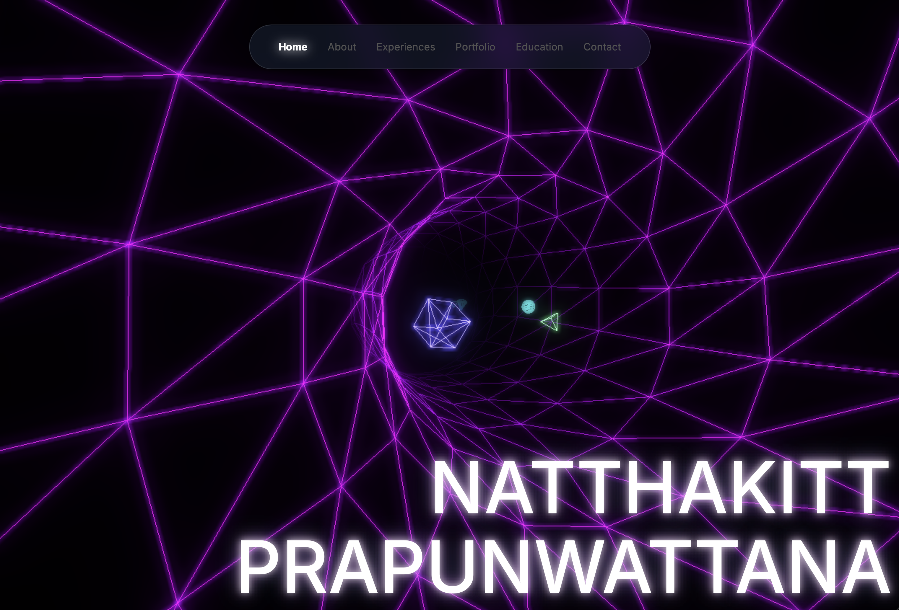

# Developer Portfolio | Project Showcase

  

<!-- 
  
 -->

### High-Performance React + Three.js + Framer Motion

---

## 🛠️ The Technology Behind the Experience

This repository serves as a technical demonstration of modern web engineering, merging physics-based 3D environments with complex motion systems to create a premium, interactive experience.

### 1. Physics-Based 3D Background Hero page(`TunnelDARK`)
The visual core of the application is built on a custom **Three.js** implementation. 
- **Spline Sampling**: Utilizes a pre-sampled 3D spline to create a procedural "Wormhole tunnel".
- **Interactive Physics**: Features a particle system with momentum damping and corrective forces, allowing users to "shove" digital nodes with mouse interactions.
- **Post-Processing**: Integrated `UnrealBloomPass` and `EffectComposer` for a high-fidelity, emissive aesthetic.

### 2. High-Fidelity Motion Systems
Animations are engineered using **Framer Motion** to provide organic, fluid transitions that react to user scroll and interaction.
- **Scroll-Synchronized Reveal**: Custom `whileInView` observers and staggered variants ensure that content reveals itself precisely as it enters the viewport.
- **Bento Grid Logic**: Technical data is organized into responsive "bento" layouts that utilize complex layout animations.
- **Navigation Flux**: An `AnimatePresence` driven navigation bar that adapts based on scroll direction and velocity.

### 3. Glassmorphism & Modern UI/UX
The interface is built with **Tailwind CSS**, utilizing a curated design system of HSL-tailored colors and backdrop-filter effects.
- **Dynamic Glass Panels**: Multi-layered transparency with border-glow effects.
- **Typography**: Focused on technical clarity using Google Material Symbols and modern sans-serif typefaces.
- **Responsiveness**: Fully engineered to maintain visual impact across all device architectures.

---

**Built by Natthakitt Prapunwattana**
| *HKU Computer Science*
